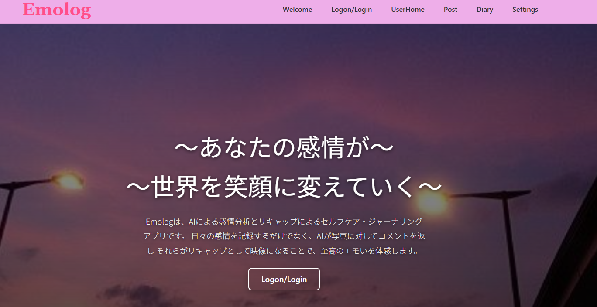

# Emolog (エモログ)
[](https://nextjs.org/)
[](https://fastapi.tiangolo.com/)
[](https://supabase.io/)
[](https://ai.google.dev/)





```markdown
アーキテクチャ

このプロジェクトは、VercelにデプロイされたNext.jsフロントエンドと、Dockerコンテナで動作するFastAPIバックエンドで構成されています。  
Supabaseが認証、DB、ストレージのすべてを担います。

┌───────────────┐     ┌───────────────────┐     ┌──────────────┐
│  Browser      │────▶│  Next.js (Vercel) │────▶│  Supabase    │
│ (React)       │     │ (Frontend)        │     │ (Auth, DB)   │
└───────────────┘     └─────────┬─────────┘     └───────▲──────┘
                              │                       │
                              │ (POST /analyze)       │ (Save Data)
                              ▼                       │
                  ┌─────────────┴───────────┐         │
                  │  FastAPI (Docker)       │─────────┘
                  │ (Backend API)           │
                  └─────────────┬───────────┘
                                │
                                ▼
                      ┌───────────────────┐
                      │  Gemini API       │
                      │ (Image Analysis)  │
                      └───────────────────┘
```


## 製品概要
### 製品開発のきっかけ
従来のジャーナリングやセルフケアアプリは、記録のモチベーション維持が難しく、特に感情を文字で表現することが苦手なユーザーにとっては客観的なフィードバックが不足しているという課題がありました。本製品は、この課題をAIによる分析とゲーミフィケーション要素で解決することを目指しています。

### 製品説明
Emologは、**AIによる感情分析**と**AIによるコメント感情分析**の要素を組み合わせた、新しいセルフケア・ジャーナリングアプリです。
ユーザーが写真やコメントを投稿すると、FastAPIバックエンドがGoogle Gemini APIを呼び出し、画像の内容と感情を分析します。分析結果に基づき、感情タグとコメントが生成され、記録が「世界を育てる」というフィードバックを通じて、ユーザーにポジティブなセルフケア体験を提供します。

### 特長
#### 1. 特長1: マルチモーダルAIによる感情の言語化
ユーザーの投稿（写真と任意コメント）に対し、Gemini APIを利用したFastAPIが感情を分析し、**親しみやすい文体で30文字程度のコメント**を自動生成して記録します。
#### 2. 特長2: 連続投稿の可視化 (ストリーク)
ホーム画面（`/user-home`）にて、ユーザーの**連続投稿日数（ストリーク）**を大きく表示するUIを実装し、モチベーションの維持を促します。
#### 3. 特長3: 月末のタイムラプス生成機能
日記ページでは、その月の写真投稿を振り返る**タイムラプス動画**をブラウザ上で生成する機能（Web APIは不使用）を実装しています。

### 解決出来ること
* **記録の習慣化:** 連続日数やアバター育成要素を通じて、ジャーナリングの継続を強力にサポートします。
* **感情の客観視:** AIによる客観的な感情フィードバックにより、自己の感情状態を冷静に把握する手助けをします。


### こだわり
* **FastAPIによる高速なAI処理フロー:** 画像のアップロードからAI分析、DB保存までの処理を高速なFastAPIで一貫させ、ユーザーへの分析結果の**即時フィードバック（モーダル）**を実現しました。
* **DB環境の採用:** Supabaseをインフラの中心に据えることで、認証、データベース、ストレージを迅速かつ堅牢に構築しました。
* **Geminiの採用:** 初めてのAI実装を行いました。

## 開発技術
### 活用した技術
#### API・データ
* **Google Gemini API (gemini-2.5-flash):** 画像解析とJSON形式での感情コメント生成。
* **Supabase:** PostgreSQLデータベース、Auth（認証）、Storage（画像格納）として利用。

#### フレームワーク・ライブラリ・モジュール
* **Next.js 15 (React):** フロントエンド構築。
* **FastAPI / Uvicorn:** PythonによるAI処理のための軽量APIサーバー。

#### デバイス
* Webブラウザ (モバイル/デスクトップ)

### 本プロジェクトのコア機能
* **Gemini-FastAPI連携による感情分析API:** 画像の受け取り、AI分析、Supabaseへの保存（DB/Storage）を一連の処理として実装したバックエンドAPI (`/analyze-and-save`)。
* **ブラウザベースのタイムラプス生成:** 月末に、その月の投稿画像をブラウザのCanvas機能を利用して動画として結合・生成する機能。


## ローカルでの実行方法

このプロジェクトは、Next.js（フロントエンド）とFastAPI（バックエンド）で構成されています。

### 必要なもの
* Node.js (v18.18.0 以上)
* Docker と Docker Compose
* Supabase アカウント (DB, Auth, Storage)
* Google Gemini API キー

### 1. 環境変数の設定

プロジェクトを動作させるには、2つの `.env.local` ファイルが必要です。

**(A) バックエンド用 (`/` ルートディレクトリ)**

リポジトリのルートに `.env.local` ファイルを作成します (`.env.sample` をコピーしてください)。
`backend/main.py` が参照するSupabaseの**サービスキー**とGeminiキーを設定します。

```bash
# /.env.local
SUPABASE_URL="[https://your-project-ref.supabase.co](https://your-project-ref.supabase.co)"
SUPABASE_SERVICE_ROLE_KEY="your-supabase-service-role-key"
GEMINI_API_KEY="your-gemini-api-key"
# /frontend/.env.local
NEXT_PUBLIC_SUPABASE_URL="[https://your-project-ref.supabase.co](https://your-project-ref.supabase.co)"
NEXT_PUBLIC_SUPABASE_ANON_KEY="your-supabase-anon-key"

# Dockerで起動するバックエンドAPIのURL
NEXT_PUBLIC_API_URL="http://localhost:8000"

# ルートディレクトリで実行
docker-compose up -d --build

# frontendディレクトリに移動
cd frontend

# 依存関係をインストール
npm install

# 開発サーバーを起動
npm run dev
```

## デプロイURL
https://emolog-psi.vercel.app/